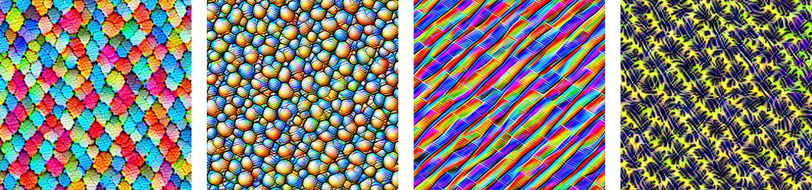

# DeepDream in PyTorch



This repo contains an implementation of the DeepDream algorithm in PyTorch. It is based on my [blog post](https://sigmoidprime.com/post/deepdream) over at [sigmoid prime](https://sigmoidprime.com/). I suggest you read that if you want some intuition for how DeepDream works. If you want to jump straight into the code, take a look at `dream.py` and `helpers.py`.

If you simply want to create your own "dreams," I suggest you check out the Jupyter notebook in `example.ipynb`. It will allow you to run the algorithm on your own images and tweak all the relevant parameters.

In short, the code works by defining a dictionary mapping layer names to the channels we wish to optimize for during gradient ascent.

```python
settings = {
    "Mixed_5b": None,
    "Mixed_5c": None,
    "Mixed_5d": None,
    "Mixed_6a": None,
    "Mixed_6b": (42, 69),
    "Mixed_6c": None,
    "Mixed_6d": None,
    "Mixed_6e": None,
    "Mixed_7a": None,
    "Mixed_7b": None,
    "Mixed_7c": None,
}
```

`None` means that we do not wish to optimize the layer, `"all"` means optimize all activations in the layer, and a tuple of ints (such as above) means that we wish to optimize those specific channels in the layer.

After defining which activations to optimize, we can simply load an image and pass it to the `dream` function:

```python
from PIL import Image

img = Image.open("flowers.jpg")
dream_img = dream(img, num_octaves=3, steps_per_octave=100, settings=settings)
```

There is also a helper function to generate images of random noise. This is cool when you couple it with the `zoom_dream` function (the images above were generated in this way):

```python
img = random_noise(300, 300)
dream_img = zoom_dream(img, num_frames=50, steps_per_frame=100, settings=settings)
```
